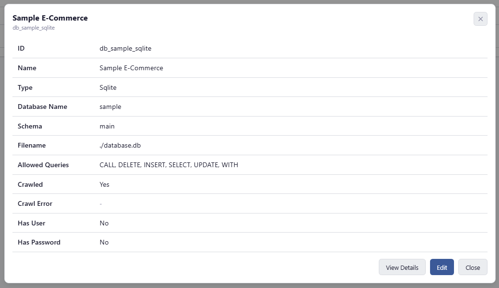
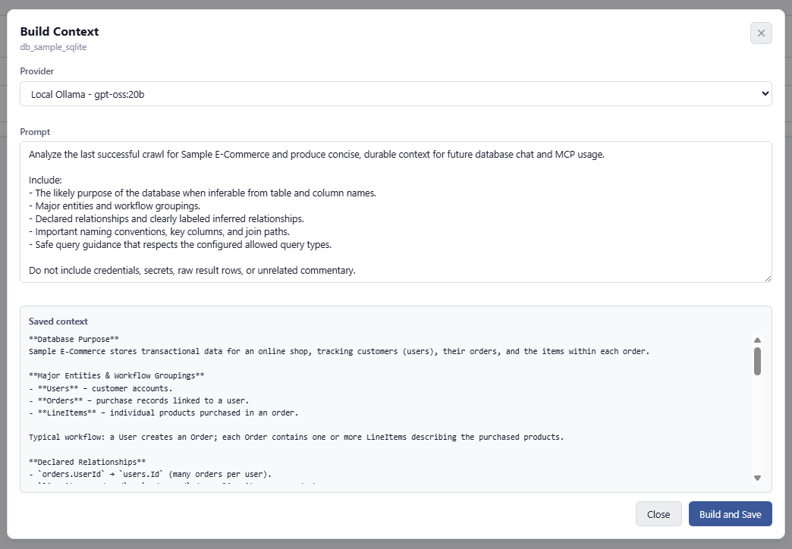
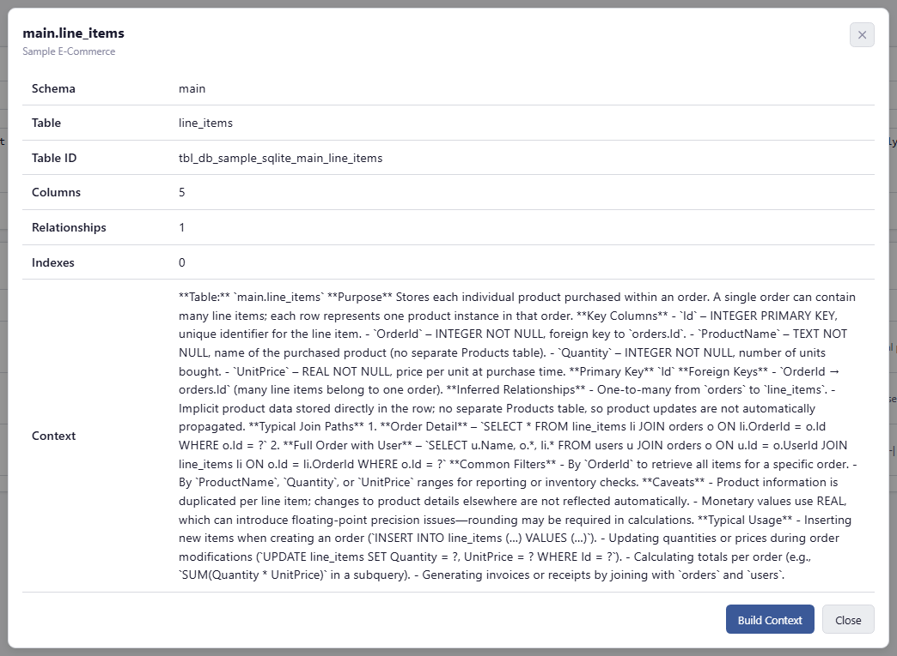
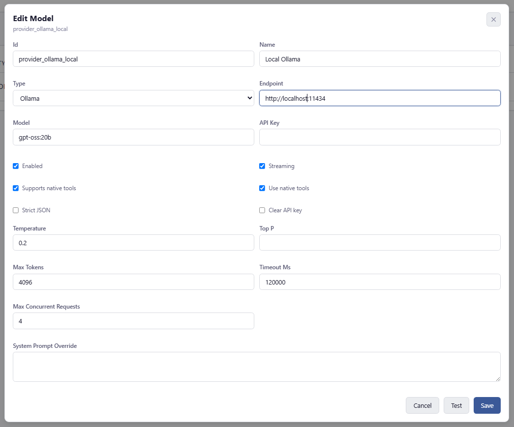
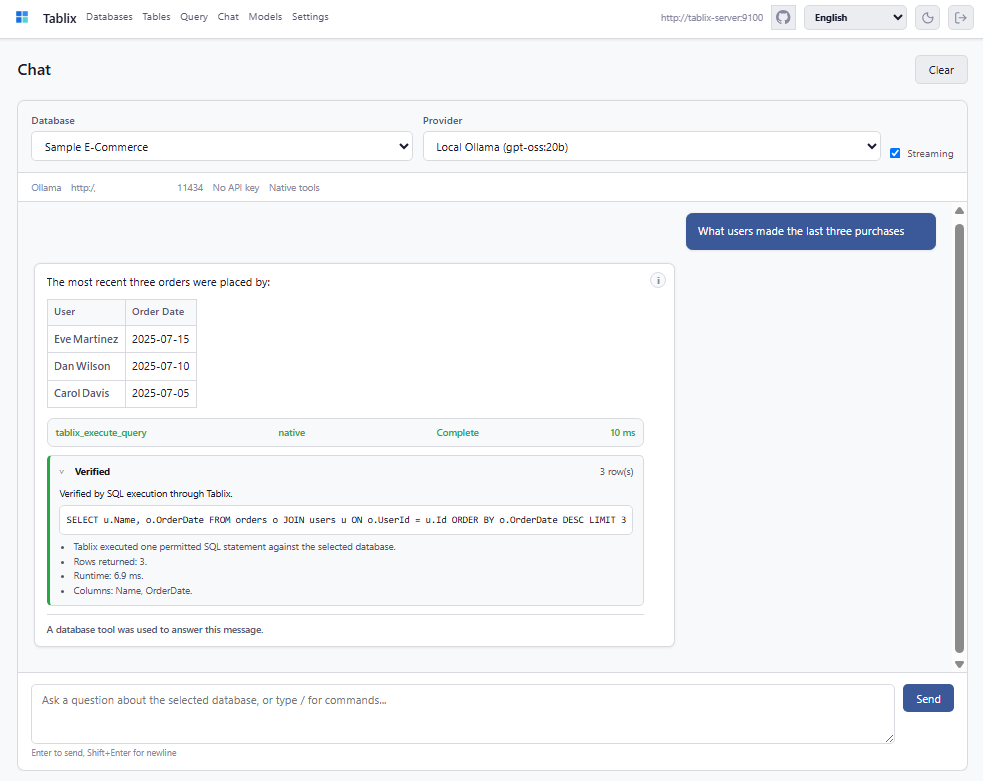

<p align="center">
  
</p>

<p align="center">
  <b>v0.3.0 - ALPHA</b> - API and structure may change without notice
</p>

# Tablix

Tablix is a database gateway for AI agents, connecting your databases through MCP, REST, and a dashboard with schema discovery, durable context, NL2SQL-powered query generation, guarded execution, and database-aware chat. Tablix helps agents understand what your data means, generate safer SQL, execute permitted queries, and return answers grounded in actual results.

<details>
  <summary><strong>Dashboard Screenshots</strong></summary>

  <p>
    
  </p>
  <p>
    
  </p>
  <p>
    
  </p>
  <p>
    
  </p>
  <p>
    
  </p>
</details>

## What's New in v0.3.0

v0.3.0 turns Tablix into a more complete database-agent workspace: product state lives in SQLite, large schemas are discoverable in pages, durable context can be managed at database and table scope, and the dashboard can take a user from first login to database chat.

- **Large-schema-safe discovery:** agents can page through compact table and relationship indexes before requesting full table geometry.
- **SQLite-backed product state:** model providers, configured databases, crawl metadata, database context, table context, and setup wizard state are persisted in `tablix.db`; `tablix.json` is now bootstrap/server configuration.
- **Database and table context:** REST, MCP, and dashboard workflows can read, generate, edit, and persist durable context without returning secrets or raw data.
- **Guided first-run setup:** the setup wizard walks through model provider validation, database validation, crawl, database context, and table context generation.
- **NL2SQL-powered database chat:** the Chat page uses PolyPrompt providers, markdown rendering, native tool calls when supported, model-based fallback planning, guarded query execution, inline tool-call displays, and per-message telemetry.
- **Verified answers:** REST chat responses and streaming completion events now include a verification envelope showing whether the answer was verified, partial, blocked, or ambiguous, plus the SQL, row count, and evidence when Tablix executed a query.
- **Schema-to-domain intelligence:** database detail, REST, and MCP can derive domain entities, likely metrics, common filters, freshness columns, context quality, and MCP-ready agent packs from crawled schema and saved context.
- **Inferred relationship candidates:** relationship listing can include name-based inferred join candidates with confidence scores alongside declared foreign keys, making weakly constrained databases easier for agents to navigate.
- **Ambiguity handling:** Tablix detects ambiguous terms such as active, latest, status, revenue, owner, and customer before data-answer execution and asks a targeted clarification question instead of guessing.
- **Chat context updates:** dashboard Chat exposes query execution plus database/table context update tools to capable models so durable insights can be persisted without saving secrets, raw rows, or unsupported guesses.
- **Provider throughput controls:** `RequestTimeoutMs` applies to one provider request, while `MaxConcurrentRequests` caps parallel provider calls for batch operations such as table-context generation.
- **Dashboard productivity controls:** crawl progress streams table-level status, table-context generation updates rows as individual tables complete, query results can be copied as JSON or downloaded as CSV, the empty Chat state is centered in the transcript, the login page shows the configured server URL, and dashboard labels/help text can be localized.
- **Touchstone test infrastructure:** shared tests now run through the CLI, xUnit, and NUnit from one source of truth.

## What Is Tablix?

Tablix sits between your databases and the agents or people asking questions of them. It crawls schema metadata, stores durable database and table context, exposes MCP and REST APIs, and gives models a controlled tool surface for NL2SQL query generation and execution. Instead of leaving an agent to guess table structure or hand you SQL to run manually, Tablix gives it the schema, context, permissions, and execution path needed to answer from real database results.

A built-in dashboard provides the same workflow for humans: configure databases and model providers, inspect schema, build context, run queries, and chat with a selected database.

**Supported databases:** SQLite, PostgreSQL, MySQL, SQL Server.

## Why Use Tablix?

- **Turn natural language into grounded answers.** Agents can use schema discovery, durable context, and NL2SQL generation to answer questions from actual query results, not fabricated rows or unexecuted SQL snippets.
- **Give agents a controlled database interface.** Connect Tablix via MCP to Claude Code, Cursor, Codex, Gemini, or other tool-capable clients. Agents can discover databases, inspect tables, understand relationships, execute permitted queries, and update durable context when new reusable insights are found.
- **Make database meaning explicit.** Store database-level and table-level context that explains business purpose, important columns, join paths, filters, caveats, and inferred relationships. Tablix also scores context quality and generates agent packs so context gaps are visible.
- **Guard query execution.** Each database entry specifies which SQL statement types are allowed (`SELECT`, `INSERT`, `UPDATE`, `DELETE`, etc.). Tablix validates statement type, rejects multi-statement SQL, restricts calls to the selected database, and executes through its own query service.
- **Use the same gateway from UI or API.** The dashboard supports setup, schema browsing, query execution, model/provider management, context generation, and database chat. REST exposes the same core workflows for automation.

## How It Works

1. Configure one or more database connections and model providers in the setup wizard, dashboard, REST API, or seeded `tablix.db`.
2. Tablix crawls schema metadata, stores table geometry and relationships, and persists database/table context in SQLite.
3. AI agents connect through MCP, while humans use the dashboard or REST API.
4. For data questions, the model uses context and schema metadata to generate SQL, then calls Tablix tools to execute permitted queries instead of merely returning SQL.
5. Tablix validates the selected database and allowed statement type, runs the query, returns actual results, and asks the model to answer from those results.
6. When durable relationships or corrections are discovered, context update tools can persist them for future conversations.

## API References

- [REST_API.md](REST_API.md) documents every REST endpoint, request body, response shape, error contract, and pagination field.
- [MCP_API.md](MCP_API.md) documents every MCP tool, input schema, response shape, agent workflow, and model-facing safety guidance.
- Swagger UI is available at `/swagger` when the server is running.

REST read endpoints and MCP discovery tools intentionally redact database credentials. `User` and `Password` are accepted only in configuration write requests; read/discovery responses expose `HasUser` and `HasPassword` booleans instead.

## Getting Started

For a full step-by-step walkthrough that covers Docker deployment, model provider setup, database setup, crawling, context building, and chat, see [GETTING_STARTED.md](GETTING_STARTED.md).

### Running from Docker

The quickest way to get Tablix running is with Docker Compose. The setup includes a Tablix server, a dashboard UI, and a sample SQLite database.

```bash
git clone https://github.com/jchristn/Tablix.git
cd Tablix/docker
docker compose pull
docker compose up -d
```

Once running, the following services are available:

| Service | URL |
|---------|-----|
| REST API | http://localhost:9100 |
| Swagger UI | http://localhost:9100/swagger |
| Dashboard | http://localhost:9101 |
| MCP | http://localhost:9102/rpc |

Default API key: `tablixadmin`

The sample SQLite database includes `users`, `orders`, and `line_items` tables so you can explore schema discovery and query execution immediately.

#### Docker Compose Details

The `docker/compose.yaml` starts two containers:

- **tablix-server** (`jchristn77/tablix-server`) - the REST API and MCP server. Ports 9100 (REST) and 9102 (MCP) are exposed. The bootstrap `tablix.json`, sample `database.db`, and `logs/` directory are bind-mounted from the `docker/` directory. Product state is stored at `/data/tablix.db`, backed by the same host `docker/` directory, so the server can create the SQLite file on first run if it is missing.
- **tablix-ui** (`jchristn77/tablix-ui`) - the dashboard, served via nginx on port 9101. It proxies API calls to the server using the `TABLIX_SERVER_URL` environment variable and shows that configured URL on the login page.

Both containers include simple curl-based healthchecks that run every 5 seconds with a 2 second timeout and use Docker's standard retry handling. The UI depends on a healthy backend and applies a 15 second startup delay through `TABLIX_UI_STARTUP_DELAY_SECONDS`.

#### Running Individual Containers

To run the server standalone with `docker run`:

```bash
docker run -d \
  -p 9100:9100 \
  -p 9102:9102 \
  -v $(pwd)/tablix.json:/app/tablix.json \
  -v $(pwd):/data \
  -v $(pwd)/database.db:/app/database.db \
  -v $(pwd)/logs:/app/logs \
  jchristn77/tablix-server:v0.3.0
```

To run the dashboard standalone:

```bash
docker run -d \
  -p 9101:9101 \
  -e TABLIX_SERVER_URL=http://host.docker.internal:9100 \
  jchristn77/tablix-ui:v0.3.0
```

#### Factory Reset

To restore the Docker environment to its default state (resets `tablix.json`, `tablix.db`, `database.db`, and logs to their original contents):

```bash
cd docker/factory
./reset.sh      # Linux/Mac
reset.bat       # Windows
```

#### Building Images

To build and push the release Docker images from source, use the aggregate script from the repository root:

```bash
build-all.bat v0.3.0
```

The aggregate script runs the dashboard and server image builds in order and pushes both `v0.3.0` and `latest` tags for `jchristn77/tablix-ui` and `jchristn77/tablix-server`. It expects Docker Buildx and Docker Hub push permissions for the `jchristn77` repositories.

The individual image scripts remain available when only one image needs to be rebuilt:

```bash
build-server.bat v0.3.0
build-dashboard.bat v0.3.0
```

### Running from Source

```bash
cd src
dotnet build
dotnet run --project Tablix.Server
```

The server creates a default `tablix.json` on first run for bootstrap settings and initializes `tablix.db` with default model providers, a sample SQLite database connection, setup state, and persistence schema. Swagger UI is available at http://localhost:9100/swagger.

The dashboard includes Databases, Query, Chat, Models, and Settings pages plus a first-run setup wizard. On first sign-in, the wizard can validate a model provider, validate a database connection, crawl schema metadata, generate database context, generate table context, and leave the user ready for Chat. Users can skip the wizard and perform the same work from the main pages.

The database detail view shows saved database context from database-scope `context_records` in `tablix.db`, supports inline context edits through `POST /v1/database/{id}/context`, displays table-level context editors, can generate one table context through `POST /v1/database/{id}/table-context/{tableId}/build`, and uses `POST /v1/database/{id}/crawl/stream` to show schema crawl progress in real time with per-table status. It also displays schema-to-domain intelligence from `GET /v1/database/{id}/intelligence`: context quality, inferred relationships, ambiguity signals, domain entities, starter questions, and a copyable agent pack. The setup wizard generates table context with one request per table, up to the selected provider's `MaxConcurrentRequests`, and fills each table's context editor as soon as that table completes.

The Models page manages model providers, provider-specific system prompt overrides, native-tool settings, per-request timeouts, concurrency limits, and connectivity tests. The Databases page exposes row actions from an overflow menu, including Build Context and Delete. Build Context lets a user edit model instructions, generate context from the last successful crawl through a configured provider, and persist the result to SQLite. The Query page can copy result JSON or download result rows as CSV. The Chat page selects a database and provider, supports streaming and non-streaming responses, renders markdown, can execute permitted queries through PolyPrompt native tool calls or server-side fallback planning, displays inline tool calls, shows the execution path, exposes per-message telemetry, and renders verified-answer metadata. The Settings page edits form-based bootstrap/server settings, prompt-processing settings, and chat-tool settings, and annotates values that are saved immediately but require server restart to affect active listeners, logging, or persistence filename/type.

Dashboard localization covers static visible labels, control help/tooltips, placeholders, and accessibility labels for English, Spanish, French, Italian, Portuguese, Mandarin, Cantonese, a Kanji-labeled Japanese option, Japanese, and Farsi. Farsi switches the document direction to RTL. Dynamic database names, query results, generated chat content, markdown responses, context text, and server-returned errors are intentionally left as authored or returned.

### Running Dashboard Locally

```bash
cd dashboard
npm install
npm run dev
```

For local development, set `VITE_TABLIX_SERVER_URL` or `TABLIX_SERVER_URL` before starting Vite to prepopulate the login page server URL. The login page also lets the user override the server URL; edited values are stored in browser local storage. In Docker, the dashboard uses `TABLIX_SERVER_URL` for the nginx proxy target and shows it on the login page without forcing browser clients to call the internal container hostname directly.

### Running Tests

```bash
dotnet build src/Tablix.slnx
dotnet run --project src/Test.Automated/Test.Automated.csproj
dotnet test src/Test.Xunit/Test.Xunit.csproj
dotnet test src/Test.Nunit/Test.Nunit.csproj
```

Tests are defined once in `Test.Shared` using Touchstone descriptors and exposed through the console runner, xUnit adapter, and NUnit adapter.
The xUnit and NUnit projects are intentionally adapter surfaces over the same shared tests, so coverage changes should start in `src/Test.Shared`.

## Installing MCP

Tablix can automatically install its MCP configuration into supported AI clients:

```bash
dotnet run --project src/Tablix.Server -- --install-mcp
```

This detects and patches configuration for:

| Client | Config File |
|--------|------------|
| Claude Code | `~/.claude.json` |
| Cursor | `~/.cursor/mcp.json` |
| Codex | `~/.codex/config.json` |
| Gemini | `~/.gemini/settings.json` |

After installing or updating MCP configuration, restart your AI agent or client to pick up the changes.

To configure manually, add to your client's MCP settings:

```json
{
  "mcpServers": {
    "tablix": {
      "type": "http",
      "url": "http://localhost:9102/rpc"
    }
  }
}
```

### MCP Tools

Tablix exposes thirteen MCP tools. The recommended discovery flow for AI agents is:

See [MCP_API.md](MCP_API.md) for the complete MCP tool contract, response schemas, examples, and model guidance.

1. **`tablix_discover_databases`** - List configured databases
2. **`tablix_list_tables`** - Page through compact table summaries
3. **`tablix_list_relationships`** - Page through compact declared and optionally inferred relationship edges
4. **`tablix_discover_table`** - Get full geometry for specific tables
5. **`tablix_execute_query`** - Execute a SQL query once the schema is understood
6. **`tablix_get_database_context`** - Read database context for one or more databases
7. **`tablix_get_table_context`** - Read table context for one or more tables
8. **`tablix_update_database_context`** - Persist analyzed database context back to `tablix.db`
9. **`tablix_update_table_context`** - Persist analyzed table context back to `tablix.db`
10. **`tablix_update_context`** - General context update tool with `scope = Database` or `scope = Table`
11. **`tablix_discover_database`** - Full database geometry for small databases or explicit full-schema requests
12. **`tablix_get_database_intelligence`** - Read domain entities, inferred relationships, ambiguity signals, context quality, and optionally an agent pack
13. **`tablix_get_agent_pack`** - Read MCP-ready instructions and starter questions for one database

#### Choosing the Right Discovery Tool

| Need | Use | Why |
|------|-----|-----|
| Find configured databases | `tablix_discover_databases` | Returns IDs, redacted metadata, allowed query types, crawl state, and saved context |
| Understand a large database safely | `tablix_list_tables` then `tablix_list_relationships` | Keeps responses compact and pageable |
| Bootstrap an agent quickly | `tablix_get_agent_pack` | Returns selected-database instructions, entity guidance, relationship notes, ambiguity warnings, and starter questions |
| Assess context readiness | `tablix_get_database_intelligence` | Returns context quality, ambiguity signals, and domain intelligence |
| Inspect tables before writing SQL | `tablix_discover_table` | Returns full column, key, foreign-key, and index geometry for one table |
| Read database context explicitly | `tablix_get_database_context` | Returns durable database-level guidance for one or more databases |
| Read table context explicitly | `tablix_get_table_context` | Returns durable table-level guidance for one or more tables |
| Retrieve a complete small schema | `tablix_discover_database` | Convenient when the schema is known to fit comfortably in model context |
| Save human-approved database analysis | `tablix_update_database_context` | Persists curated database-level context back to `tablix.db` |
| Save human-approved table analysis | `tablix_update_table_context` | Persists curated table-level context back to `tablix.db` |

For large databases, prefer this loop:

1. Call `tablix_discover_databases` and select the database by `Id`.
2. Call `tablix_list_tables` with a conservative `maxResults` such as `50`.
3. If `EndOfResults` is false, call `tablix_list_tables` again with `skip` set to `NextSkip`.
4. Call `tablix_list_relationships` the same way to collect declared foreign-key edges; set `includeInferred` when declared FKs are incomplete.
5. Call `tablix_get_table_context` for tables needed by the user's question.
6. Call `tablix_discover_table` only for tables needed by the user's question.
7. Execute read-only exploratory SQL only after checking `AllowedQueries` and validating table geometry.
8. Call `tablix_update_database_context` or `tablix_update_table_context` only when the user asks to persist the analysis or refreshed schema proves saved context is stale.

#### Agent Best Practices

- Start with `tablix_discover_databases`; use the returned `Context` as authoritative user guidance and check `AllowedQueries` before executing SQL.
- Treat discovery metadata as intentionally redacted. Tablix never returns database usernames or passwords through MCP discovery; `HasUser` and `HasPassword` are booleans only.
- For large schemas, avoid full-database geometry. Use `tablix_list_tables` and `tablix_list_relationships`, following `NextSkip` until `EndOfResults` is true.
- Treat `tablix_list_tables` as a compact index, not enough information for most SQL. Call `tablix_discover_table` for every table you plan to select from, join, filter on, insert into, update, or delete from.
- Use `tablix_get_database_context` for database-level guidance and `tablix_get_table_context` for table-level guidance. Context improves interpretation but does not replace schema validation.
- Treat `tablix_list_relationships` relationships with `Source = declared_fk` as declared evidence. Treat `Source = inferred_name_match` as a candidate until confirmed by context, schema inspection, or user approval.
- Use `tablix_get_database_intelligence` or `tablix_get_agent_pack` when you need a compact domain brief before deeper inspection.
- When inferring relationships from column names or business context, clearly label them as inferred in answers and saved context.
- Prefer `SELECT` for exploration. Only run writes when the user explicitly asks and the database `AllowedQueries` permits the statement type.
- Use `tablix_update_database_context` for database-level context and `tablix_update_table_context` for table-level context. `tablix_update_context` remains available for generic scoped workflows. Do not store secrets, raw query results, or unsupported guesses as facts.

#### `tablix_discover_databases`

List all configured databases with redacted metadata and user-supplied context. Credential values are never returned; `HasUser` and `HasPassword` only indicate whether credentials are configured.

| Parameter | Type | Required | Description |
|-----------|------|----------|-------------|
| `maxResults` | integer | No | Maximum results to return (1-1000, default 100) |
| `skip` | integer | No | Number of records to skip (default 0) |
| `filter` | string | No | Filter by database ID or name |

#### `tablix_discover_database`

Get schema geometry for a database. This can produce large responses; use only for small databases or explicit full-schema requests. For large databases, prefer `tablix_list_tables`, `tablix_list_relationships`, and `tablix_discover_table`.

| Parameter | Type | Required | Description |
|-----------|------|----------|-------------|
| `databaseId` | string | Yes | Database entry ID |
| `maxTables` | integer | No | Optional maximum number of tables to return (1-1000) |
| `skip` | integer | No | Optional number of tables to skip |

#### `tablix_list_tables`

List tables in a database with schema names, column counts, foreign key counts, index counts, and pagination metadata. Use this as the compact table index for large schemas.

| Parameter | Type | Required | Description |
|-----------|------|----------|-------------|
| `databaseId` | string | Yes | Database entry ID |
| `maxResults` | integer | No | Maximum tables to return (1-1000, default 100) |
| `skip` | integer | No | Number of tables to skip (default 0) |
| `filter` | string | No | Filter by table or schema name |
| `schema` | string | No | Filter by schema name |

Returns `MaxResults`, `Skip`, `TotalRecords`, `RecordsRemaining`, `EndOfResults`, and `NextSkip`. If `EndOfResults` is false, call the tool again with `skip` set to `NextSkip`.

#### `tablix_list_relationships`

List compact relationship edges for a database. Declared foreign keys are returned with `Source = declared_fk`; when `includeInferred` is true, name-based inferred join candidates are returned with `Source = inferred_name_match` and a confidence score. Absence of a declared relationship means no declared FK was discovered, not proof that tables are unrelated.

| Parameter | Type | Required | Description |
|-----------|------|----------|-------------|
| `databaseId` | string | Yes | Database entry ID |
| `maxResults` | integer | No | Maximum relationships to return (1-1000, default 100) |
| `skip` | integer | No | Number of relationships to skip (default 0) |
| `filter` | string | No | Filter by table, column, schema, or constraint name |
| `schema` | string | No | Filter by source or target schema |
| `includeInferred` | boolean | No | Include name-based inferred relationship candidates with confidence scores |

#### `tablix_get_database_intelligence`

Get schema-to-domain intelligence for one database: domain entities, relationship candidates, ambiguity signals, context quality, and an optional agent pack.

| Parameter | Type | Required | Description |
|-----------|------|----------|-------------|
| `databaseId` | string | Yes | Database entry ID |
| `includeAgentPack` | boolean | No | Include markdown agent pack in the response |

#### `tablix_get_agent_pack`

Get MCP-ready instructions for one database, including selected database ID, safe discovery loop, major entities, relationship notes, ambiguity warnings, and starter questions.

| Parameter | Type | Required | Description |
|-----------|------|----------|-------------|
| `databaseId` | string | Yes | Database entry ID |

#### `tablix_discover_table`

Get full geometry for a single table: columns, data types, primary keys, foreign keys, and indexes.

| Parameter | Type | Required | Description |
|-----------|------|----------|-------------|
| `databaseId` | string | Yes | Database entry ID |
| `tableName` | string | Yes | Table name to retrieve geometry for |

#### `tablix_execute_query`

Execute a SQL query against a database. The query must be a single statement with no semicolons, and the statement type must be in the database's `AllowedQueries` list. Validate relevant tables and columns first with `tablix_discover_table`.

When the user asks for actual data or a requested database change using phrases like "show me", "how many", "count", "list", "find", "total", "average", "latest", "top", "add", "update", or "delete", agents should execute a permitted query and report the returned result or write outcome instead of only providing SQL text.

| Parameter | Type | Required | Description |
|-----------|------|----------|-------------|
| `databaseId` | string | Yes | Database entry ID |
| `query` | string | Yes | SQL query to execute |

Returns `Success`, `RowsReturned`, `TotalMs`, and a `Data` object containing `Columns` and `Rows`.

#### `tablix_get_database_context`

Read database-level context for one database, multiple databases, or a paged set of configured databases.

| Parameter | Type | Required | Description |
|-----------|------|----------|-------------|
| `databaseId` | string | No | Single database entry ID |
| `databaseIds` | string[] | No | Multiple database entry IDs |
| `maxResults` | integer | No | Maximum contexts to return when listing |
| `skip` | integer | No | Number of contexts to skip when listing |
| `filter` | string | No | Filter by database ID or name |

#### `tablix_get_table_context`

Read table-level context for one table, multiple tables, or a paged set of table contexts.

| Parameter | Type | Required | Description |
|-----------|------|----------|-------------|
| `databaseId` | string | Yes | Database entry ID |
| `tableId` | string | No | Single table metadata ID |
| `tableIds` | string[] | No | Multiple table metadata IDs |
| `tableName` | string | No | Single table name |
| `tableNames` | string[] | No | Multiple table names |
| `includeEmpty` | boolean | No | Include crawled tables even when no table context exists |
| `maxResults` | integer | No | Maximum contexts to return when listing |
| `skip` | integer | No | Number of contexts to skip when listing |

#### `tablix_update_database_context`

Update database-level context. The context helps AI agents understand what the database contains, how its tables relate, and what queries are useful. Preserve human-provided facts, distinguish declared relationships from inferred relationships, and avoid secrets or raw query results.

| Parameter | Type | Required | Description |
|-----------|------|----------|-------------|
| `databaseId` | string | Yes | Database entry ID |
| `context` | string | Yes | New context description |
| `mode` | string | No | `replace` or `append` (default `replace`) |

#### `tablix_update_table_context`

Update table-level context for one or more tables.

| Parameter | Type | Required | Description |
|-----------|------|----------|-------------|
| `databaseId` | string | Yes | Database entry ID |
| `tableId` | string | No | Single table metadata ID |
| `tableName` | string | No | Single table name when `tableId` is unknown |
| `context` | string | Yes for single update | New table context |
| `mode` | string | No | `replace` or `append` (default `replace`) |
| `updates` | object[] | No | Batch table context updates |

#### `tablix_update_context`

General context update tool retained for compatibility. Prefer `tablix_update_database_context` and `tablix_update_table_context`; use `scope` set to `Database` or `Table` when using the generic tool.

## Configuration

Tablix uses `tablix.json` only for bootstrap/server settings. Product state such as model providers, configured databases, crawled metadata, database context, and table context lives in `tablix.db`.

For local source runs, the default relative `tablix.db` path is resolved next to `tablix.json` and is created automatically when missing. The supplied Docker configuration uses `/data/tablix.db`, with the host `docker/` directory mounted at `/data`, so Docker does not need a pre-existing SQLite file bind mount.

```json
{
  "Persistence": {
    "Type": "Sqlite",
    "Filename": "tablix.db"
  },
  "Rest": {
    "Hostname": "*",
    "Port": 9100,
    "Ssl": false,
    "McpPort": 9102
  },
  "Logging": {
    "Servers": [],
    "ConsoleLogging": true,
    "FileLogging": true,
    "LogDirectory": "./logs/",
    "LogFilename": "tablix.log",
    "MinimumSeverity": 0,
    "EnableColors": true
  },
  "Chat": {
    "Enabled": true,
    "DefaultProviderId": "provider_ollama_local",
    "DefaultStreaming": true,
    "SystemPrompt": "You are Tablix, a database assistant...",
    "MaxContextTables": 100,
    "Tools": {
      "Enabled": true,
      "AllowReadOnlyQueries": true,
      "AllowContextUpdates": true,
      "MaxToolIterations": 8,
      "MaxToolCalls": 20,
      "ToolTimeoutMs": 30000,
      "MaxToolOutputCharacters": 12000
    },
    "PromptProcessing": {
      "Enabled": true,
      "PreferNativeToolCalls": true,
      "RequireExecutionForDataRequests": true,
      "AllowSqlOnlyByExplicitRequest": true,
      "FallbackWhenNativeToolNotCalled": true,
      "RetryAfterSchemaRefresh": true,
      "MaxNativeToolIterations": 4,
      "MaxPlanningAttempts": 2,
      "PlannerTemperature": 0
    }
  },
  "ApiKeys": ["tablixadmin"]
}
```

Model providers are managed through the dashboard **Models** page or `/v1/model`. Database connections are managed through the dashboard **Databases** page or `/v1/database`.

### Chat Settings

The `Chat` section is the configuration surface for the dashboard chat experience and prompt-processing behavior. Provider records are stored in `tablix.db`; the seeded Docker database includes provider templates for Ollama, OpenAI, OpenAI-compatible endpoints, and Gemini. Only the local Ollama provider is enabled by default; cloud providers are disabled until an endpoint, model, and API key are supplied.

Tablix uses PolyPrompt `1.5.0` for provider-normalized tool chat. When `Chat.PromptProcessing.PreferNativeToolCalls` is enabled and the selected persisted provider has native tool calls enabled, Tablix sends `tablix_execute_query`, `tablix_update_database_context`, and `tablix_update_table_context` tool definitions to the model when context updates are enabled. New providers default `UseNativeToolCalls` to `true` whenever `SupportsNativeToolCalls` is `true`; turn it off only for a specific model endpoint that fails tool-call validation. Tablix still owns query validation, execution, `AllowedQueries` enforcement, schema-refresh retry, context-update persistence, telemetry, and secret redaction. If native tools are unavailable or the model does not call a tool, `Chat.PromptProcessing.FallbackWhenNativeToolNotCalled` lets Tablix ask the model planner to classify intent and generate one permitted query only when execution is appropriate.

The default `Chat.SystemPrompt` instructs the model to restrict conversation to the selected database, its structure, its contents, and their relationships. It tells the model to use database context for database-wide guidance, table context for table-specific guidance, and schema discovery as the source of truth for table names, column names, keys, indexes, and data types. It also instructs the model to execute an allowed query with the available Tablix query tool when the user asks for data that can be answered from the database, rather than merely returning SQL for the user to run, and to never fabricate result rows, counts, names, dates, metrics, or other database facts. If query execution reports a bad or unknown column, missing column, or column type mismatch, the prompt tells the model to refresh schema by crawling or re-discovering relevant tables, then update database or table context when refreshed schema proves saved context stale. Tablix appends mandatory execution and no-fabrication rules to every effective chat system prompt.

`Chat.PromptProcessing` fields:

| Field | Description |
|-------|-------------|
| `Enabled` | Enables chat prompt processing and tool orchestration |
| `PreferNativeToolCalls` | Prefer PolyPrompt native tool calls when provider settings allow them |
| `RequireExecutionForDataRequests` | Treat data-answer questions as executable when permitted |
| `AllowSqlOnlyByExplicitRequest` | Do not execute when the user explicitly asks only for SQL |
| `FallbackWhenNativeToolNotCalled` | Use server-side planning when native tools are unavailable or omitted |
| `RetryAfterSchemaRefresh` | Recrawl and retry once for schema-related query errors |
| `MaxNativeToolIterations` | Maximum native tool loop iterations |
| `MaxPlanningAttempts` | Maximum fallback planner attempts |
| `PlannerTemperature` | Temperature used by the fallback planner |

Each provider includes an explicit `ApiKey` field stored in `tablix.db`. Providers that do not require authentication, such as a typical local Ollama instance, should leave it empty. Providers that do require authentication, such as OpenAI, Gemini, and many OpenAI-compatible services, should store their token through the Models page or Models REST API.

Each provider can also define a provider-specific system prompt. When `SystemPrompt` is set on a provider, it is used instead of the global `Chat.SystemPrompt` as that provider's base prompt for chat and model-assisted context generation. Tablix still appends mandatory selected-database, query-execution, no-fabrication, and no-secrets rules so provider overrides cannot accidentally disable execution policy.

Each provider can also define lightweight model-runner health checks. Health configuration is persisted with the provider record, while current health status and recent history are kept in memory and shown from the dashboard **Models** page. When `HealthCheckUrl` is empty, Tablix derives the default from the provider endpoint: Ollama uses `/api/tags`, OpenAI and OpenAI-compatible endpoints use `/v1/models`, and Gemini uses `/v1beta/models`.

| Field | Description |
|-------|-------------|
| `Id` | Stable provider ID referenced by `Chat.DefaultProviderId` |
| `Name` | Display name for the dashboard and logs |
| `Type` | `Ollama`, `OpenAI`, `OpenAICompatible`, or `Gemini` |
| `Endpoint` | Base provider endpoint URL |
| `ApiKey` | Provider authentication material; empty when auth is not required |
| `Model` | Default model name |
| `Enabled` | Whether the provider is selectable |
| `DefaultStreaming` | Whether chat should stream by default |
| `SystemPrompt` | Optional provider-specific base prompt; when set, it is used instead of `Chat.SystemPrompt` for that provider, with mandatory Tablix execution rules appended |
| `Temperature`, `TopP`, `MaxTokens` | Optional generation controls |
| `RequestTimeoutMs` | Per-provider-request timeout; batch operations make multiple provider requests |
| `MaxConcurrentRequests` | Maximum parallel provider requests for batch operations such as table-context generation; clamped from 1 to 16 |
| `HealthCheckEnabled` | Whether background provider health checks are active |
| `HealthCheckUrl` | Absolute URL used for background health checks |
| `HealthCheckMethod` | `GET` or `HEAD` |
| `HealthCheckIntervalMs` | Delay between background checks |
| `HealthCheckTimeoutMs` | Timeout for one health check request |
| `HealthCheckExpectedStatusCode` | HTTP status code treated as a successful check |
| `HealthyThreshold`, `UnhealthyThreshold` | Consecutive success/failure counts required to change health state |
| `HealthCheckUseAuth` | Whether the saved provider API key is sent with health check requests |
| `SupportsNativeToolCalls` | Whether the provider/model is expected to support tool calls |
| `UseNativeToolCalls` | Whether Tablix should attempt PolyPrompt native tool calls; defaults on when native tools are supported |
| `SupportsStrictJson` | Whether the provider/model is expected to follow strict JSON planner output |

`RequestTimeoutMs` is evaluated per provider call. It is not the timeout for an entire multi-table context build. Dashboard setup and table-context generation issue individual table requests and run no more than `MaxConcurrentRequests` in parallel. For local Ollama or a single-GPU endpoint, start with `MaxConcurrentRequests = 1`; raise it only after the model server proves it can handle concurrent generations.

Provider API keys are secret-bearing settings. Treat provider API keys the same way as database passwords: protect `tablix.db`, prefer environment-specific provisioning where possible, and never paste secrets into shared examples or issue reports.

### Example Database API Payloads

Database entries are not stored in `tablix.json`; these examples are request bodies for `POST /v1/database` or `PUT /v1/database/{id}`.

**SQLite**
```json
{
  "Id": "db_my_sqlite",
  "Name": "Local App Database",
  "Type": "Sqlite",
  "Filename": "./myapp.db",
  "AllowedQueries": ["SELECT"],
  "Context": "Local SQLite database for the myapp application."
}
```

**PostgreSQL**
```json
{
  "Id": "db_my_postgres",
  "Name": "Staging Orders",
  "Type": "Postgresql",
  "Hostname": "pg.example.com",
  "Port": 5432,
  "User": "readonly",
  "Password": "secret",
  "DatabaseName": "orders",
  "Schema": "public",
  "AllowedQueries": ["SELECT"],
  "Context": "Staging PostgreSQL database for the orders service."
}
```

**MySQL**
```json
{
  "Id": "db_my_mysql",
  "Name": "Production Users",
  "Type": "Mysql",
  "Hostname": "mysql.example.com",
  "Port": 3306,
  "User": "readonly",
  "Password": "secret",
  "DatabaseName": "users",
  "AllowedQueries": ["SELECT"],
  "Context": "Production MySQL database for user accounts."
}
```

**SQL Server**
```json
{
  "Id": "db_my_sqlserver",
  "Name": "Analytics Warehouse",
  "Type": "SqlServer",
  "Hostname": "sql.example.com",
  "Port": 1433,
  "User": "readonly",
  "Password": "secret",
  "DatabaseName": "analytics",
  "Schema": "dbo",
  "AllowedQueries": ["SELECT"],
  "Context": "SQL Server analytics warehouse for reporting."
}
```

### Database Entry Fields

| Field | Description |
|-------|-------------|
| `Id` | Unique identifier (e.g. `db_myapp`) |
| `Type` | `Sqlite`, `Postgresql`, `Mysql`, or `SqlServer` |
| `Hostname` | Database host (network databases) |
| `Port` | Database port (network databases) |
| `User` | Database username |
| `Password` | Database password |
| `DatabaseName` | Database name |
| `Schema` | Schema name (default `public`) |
| `Filename` | File path (SQLite) |
| `AllowedQueries` | Permitted SQL statement types |
| `Context` | Optional database-level context persisted as a database-scope `context_records` row |

### Logging Settings

| Field | Description |
|-------|-------------|
| `Servers` | Array of syslog server objects (optional, default empty) |
| `ConsoleLogging` | Enable console output (default `true`) |
| `FileLogging` | Enable file logging (default `true`) |
| `LogDirectory` | Directory for log files (default `./logs/`) |
| `LogFilename` | Log filename (default `tablix.log`) |
| `MinimumSeverity` | 0 = debug, 1 = info, 2 = warn, 3 = error, 4 = alert, 5 = critical, 6 = emergency (default `0`) |
| `EnableColors` | Colored console output (default `true`) |

Each syslog server entry has `Hostname` and `Port`:

```json
{
  "Logging": {
    "Servers": [
      { "Hostname": "127.0.0.1", "Port": 514 }
    ],
    "ConsoleLogging": true,
    "FileLogging": true,
    "LogDirectory": "./logs/",
    "LogFilename": "tablix.log",
    "MinimumSeverity": 0,
    "EnableColors": true
  }
}
```

When syslog servers are configured, log messages are forwarded to each server in addition to console and file output.

### REST API

All endpoints except health checks require `Authorization: Bearer <api-key>`. See [REST_API.md](REST_API.md) for full request/response details and [MCP_API.md](MCP_API.md) for the complete MCP tool contract. A [Postman collection](Tablix.postman_collection.json) is included in the repository. Swagger UI is available at `/swagger` when the server is running.

| Method | Path | Auth | Description |
|--------|------|------|-------------|
| `GET` | `/` | No | Health check with version, uptime |
| `HEAD` | `/` | No | Lightweight health check (200 OK) |
| `GET` | `/v1/setup` | Yes | Read first-run setup state |
| `PUT` | `/v1/setup` | Yes | Update first-run setup state |
| `POST` | `/v1/setup/complete` | Yes | Mark setup complete |
| `POST` | `/v1/setup/dismiss` | Yes | Dismiss setup without completing it |
| `GET` | `/v1/model` | Yes | List model providers |
| `GET` | `/v1/model/{id}` | Yes | Read a redacted model provider |
| `GET` | `/v1/model/health` | Yes | List model provider health statuses |
| `GET` | `/v1/model/{id}/health` | Yes | Read one model provider health status |
| `POST` | `/v1/model` | Yes | Create a model provider |
| `PUT` | `/v1/model/{id}` | Yes | Update a model provider |
| `DELETE` | `/v1/model/{id}` | Yes | Delete a model provider |
| `POST` | `/v1/model/test` | Yes | Test unsaved model provider settings |
| `POST` | `/v1/model/{id}/test` | Yes | Test a saved model provider |
| `GET` | `/v1/database` | Yes | List databases (paginated) |
| `GET` | `/v1/database/{id}` | Yes | Get database details and schema geometry |
| `GET` | `/v1/database/{id}/tables` | Yes | List database tables (paginated) |
| `GET` | `/v1/database/{id}/relationships` | Yes | List database relationships (paginated) |
| `GET` | `/v1/database/{id}/intelligence` | Yes | Read domain intelligence, inferred relationship candidates, ambiguity signals, context quality, and optional agent pack |
| `GET` | `/v1/database/{id}/agent-pack` | Yes | Read MCP-ready agent instructions for one database |
| `POST` | `/v1/database` | Yes | Add a database entry |
| `PUT` | `/v1/database/{id}` | Yes | Update a database entry |
| `POST` | `/v1/database/test` | Yes | Test unsaved database settings |
| `POST` | `/v1/database/{id}/test` | Yes | Test a saved database |
| `POST` | `/v1/database/{id}/context` | Yes | Update database context |
| `POST` | `/v1/database/{id}/context/build` | Yes | Generate and persist database context |
| `GET` | `/v1/database/{id}/table-context` | Yes | List table context records |
| `GET` | `/v1/database/{id}/table-context/{tableId}` | Yes | Read table context |
| `PUT` | `/v1/database/{id}/table-context/{tableId}` | Yes | Update table context |
| `POST` | `/v1/database/{id}/table-context/build` | Yes | Generate and persist table context records through the REST batch endpoint |
| `POST` | `/v1/database/{id}/table-context/{tableId}/build` | Yes | Generate and persist one table context record; used by the dashboard for bounded per-table generation |
| `DELETE` | `/v1/database/{id}` | Yes | Delete a database entry |
| `POST` | `/v1/database/{id}/crawl` | Yes | Re-crawl database schema |
| `POST` | `/v1/database/{id}/crawl/stream` | Yes | Re-crawl database schema with SSE progress |
| `POST` | `/v1/database/{id}/query` | Yes | Execute a SQL query |
| `GET` | `/v1/chat/options` | Yes | List chat databases and redacted providers |
| `POST` | `/v1/chat` | Yes | Send a non-streaming database chat request |
| `POST` | `/v1/chat/stream` | Yes | Send a streaming database chat request |
| `GET` | `/v1/settings` | Yes | Read redacted form-editable server settings |
| `PUT` | `/v1/settings` | Yes | Update running server settings |

### Query Validation

- Only statement types listed in `AllowedQueries` are permitted
- Multi-statement queries (containing `;`) are rejected
- Leading SQL comments are stripped before validation
- **This is a heuristic safeguard, not a security boundary**; always use database-level permissions for production safety
- Database passwords and provider API keys in `tablix.db` are stored in cleartext for v0.3.0; protect the file with OS-level permissions

### Degraded State

Initial crawls run in the background after REST and MCP listeners start. If a database crawl fails on startup (unreachable host, bad credentials, missing file):

- The server continues to start; crawl failures are non-fatal
- The affected database reports `IsCrawled: false` with a `CrawlError` message
- Re-crawl at any time via `POST /v1/database/{id}/crawl` or the dashboard
- Query execution may still work even when the crawl has not completed


## Issues and Discussions

- Report bugs and request features at https://github.com/jchristn/Tablix/issues
- Start or join discussions at https://github.com/jchristn/Tablix/discussions

## License

[MIT License](LICENSE.md) - Copyright (c) 2026 Joel Christner and Adam Wingate
